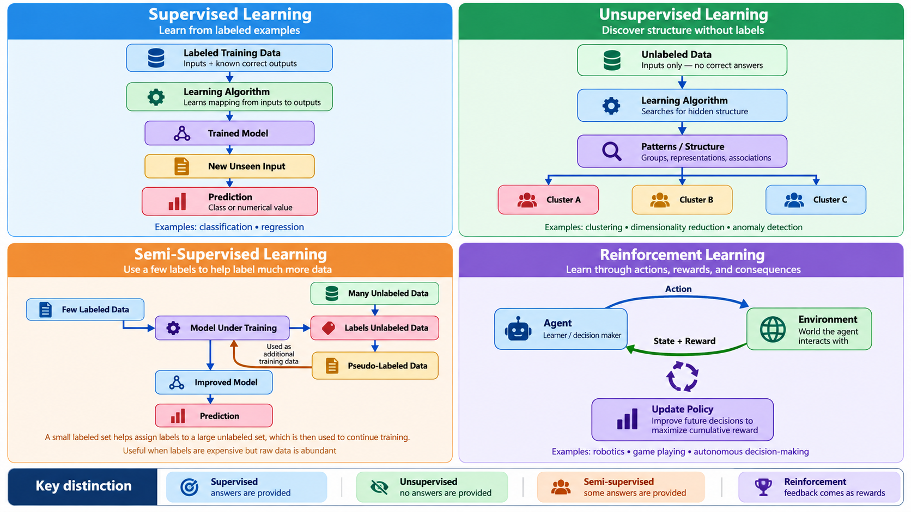

# Unit 4: Machine Learning Paradigms

> **Sessions 7 and 8** · Sep 09, 14 · **HW4 assigned Sep 14, due Sep 20**

Machine learning is a family of approaches distinguished by **what kind of information the machine receives**, **what it is asked to do with it**, and **how it works**. Unit 3 gave you one working pipeline. This unit shows you that the pipeline changes shape depending on what you have and what you want.

The practical question this unit answers is the one you will actually face on the job: *someone hands you a problem and a pile of data and you will have to decide which kind of learning this situation calls for?*

## Learning Objectives

After completing this unit, you will be able to:

- Distinguish the four main **learning paradigms** (supervised, unsupervised, semi-supervised, and reinforcement) and identify which fits a given problem.
- Explain the difference between **classification** and **clustering** by applying both to the same data.
- Describe the **exploration/exploitation trade-off** and demonstrate it in code.
- Recognize **overfitting** by watching the training/test gap open up.

## Part I — The Four Paradigms

### 1.1 Supervised Learning

The most common and best-understood paradigm.

- The model learns from **labeled data**, that is, examples where the correct output is known.
- Objective: find a function mapping inputs (features) to outputs (labels).
- Examples: predicting house prices (**regression**); classifying email as spam (**classification**).

**Common algorithms:** Linear/Logistic Regression, Decision Trees, Random Forests, Support Vector Machines, Neural Networks.

> Supervised learning mirrors **learning by example**; the machine imitates patterns it has been shown.

The hidden cost is the labels. Someone had to produce them, and that someone was almost always a human being. When you read that a model needed a million labeled examples, read it as: *a million human decisions were purchased, outsourced, or scraped from people who did not know they were labeling.*

### 1.2 Unsupervised Learning

- Works with **unlabeled data**; the algorithm must discover structure on its own.
- Objective: reveal hidden relationships or group similar points.
- Examples: customer segmentation, topic discovery, dimensionality reduction, anomaly detection in server logs.

**Common techniques:** Clustering (K-Means, DBSCAN, hierarchical), Association Rules, Principal Component Analysis.

> Unsupervised learning is about **exploration**; letting the data reveal its own organization.

```{note}
Unsupervised learning has no answer key, which means it has no accuracy score either. You cannot ask "was it right?" You can only ask "is this useful?" There are many performance measures for clustering algorithms and they are usually based on the representation structure of the model generated.
```

### 1.3 Semi-Supervised Learning

The realistic middle ground. Labels are expensive; raw data is cheap.

- A small labeled set plus a large unlabeled set.
- The model uses structure found in the unlabeled data to make better use of the few labels it has.
- Examples: medical imaging (a handful of scans read by a radiologist, thousands unread); code review classification (a few hundred reviewed PRs, tens of thousands unreviewed).

### 1.4 Reinforcement Learning

- No labeled examples at all. An **agent** takes **actions** in an **environment** and receives **rewards**.
- Objective: learn a **policy**, that is, a strategy mapping situations to actions, that maximizes cumulative reward.
- Examples: game playing (AlphaGo), robotic control, A/B-testing infrastructure, data-center cooling.

> Reinforcement learning mirrors **learning by trial and error** in which the machine discovers behavior no one demonstrated.

The core difficulty is the **exploration/exploitation trade-off**. Exploit what you already know works, and you may never discover something better. Explore constantly, and you waste effort on options you have already shown to be bad. You will see this play out numerically later in this unit.



### 1.5 Choosing a Paradigm

| You have… | You want… | Paradigm |
| :--- | :--- | :--- |
| Labeled examples | To predict a label for new cases | **Supervised** |
| Unlabeled data | To discover groups or structure | **Unsupervised** |
| A few labels, lots of raw data | To predict, cheaply | **Semi-supervised** |
| An environment and a reward signal | A strategy for acting | **Reinforcement** |

```{warning}
The most common mistake beginners make is reaching for supervised learning by reflex and then inventing labels to justify it. If the labels are guesses, the model learns your guesses, confidently and at scale. Deciding you have no labels is a legitimate, often correct, engineering conclusion.
```

## ⚙️ Hands-On: The Same Data, Two Paradigms

We return to the wine dataset from Unit 3 (<https://archive.ics.uci.edu/dataset/109/wine>), but this time we run it **twice**, once telling the algorithm the answers, once hiding them. The comparison is the whole point of this unit.

```python
import numpy as np
import matplotlib.pyplot as plt
from sklearn.datasets import load_wine
from sklearn.model_selection import train_test_split
from sklearn.preprocessing import StandardScaler
from sklearn.tree import DecisionTreeClassifier
from sklearn.cluster import KMeans
from sklearn.decomposition import PCA
from sklearn.metrics import accuracy_score, adjusted_rand_score

data = load_wine()
X, y = data.data, data.target
X_scaled = StandardScaler().fit_transform(X)   # clustering needs comparable scales

# --- SUPERVISED: we hand over the labels -------------------------
X_tr, X_te, y_tr, y_te = train_test_split(
    X_scaled, y, test_size=0.3, random_state=42, stratify=y
)
clf = DecisionTreeClassifier(max_depth=3, random_state=42).fit(X_tr, y_tr)
print(f"SUPERVISED   test accuracy: {accuracy_score(y_te, clf.predict(X_te)):.1%}")

# --- UNSUPERVISED: we hide the labels completely -----------------
km = KMeans(n_clusters=3, n_init=10, random_state=42).fit(X_scaled)
print(f"UNSUPERVISED agreement with true cultivars (ARI): "
      f"{adjusted_rand_score(y, km.labels_):.3f}")

# --- Look at both in two dimensions ------------------------------
P = PCA(n_components=2).fit_transform(X_scaled)
fig, ax = plt.subplots(1, 2, figsize=(12, 5))
ax[0].scatter(P[:, 0], P[:, 1], c=y, cmap="viridis", s=40)
ax[0].set_title("What the labels say (ground truth)")
ax[1].scatter(P[:, 0], P[:, 1], c=km.labels_, cmap="viridis", s=40)
ax[1].set_title("What K-Means found on its own")
for a in ax:
    a.set_xlabel("Principal component 1"); a.set_ylabel("Principal component 2")
plt.tight_layout(); plt.show()
```

### Reading What You Just Produced

The **Adjusted Rand Index (ARI)** measures how well two groupings agree, corrected for chance. It runs from 0 (no better than random) to 1 (identical). You should see roughly **0.90**; K-Means recovered the three cultivars almost exactly **without ever being told they existed**.

Note carefully what did *not* happen. K-Means did not learn that these are wines, that there are three cultivars, or that cultivar is the interesting variable. It found three dense blobs. That those blobs correspond to something a botanist cares about is a fact about the world, not an achievement of the algorithm. Run the same code on data where the dense blobs correspond to nothing meaningful and you will get three equally confident clusters of nonsense.

**Try changing it:**

1. Set `n_clusters=5`. K-Means will produce five clusters. What does that tell you about whether the algorithm "knows" how many groups exist?
2. Remove the `StandardScaler` line and pass raw `X` to K-Means. Accuracy collapses. Why does scaling matter for distance-based methods but not for the decision tree?
3. Change `random_state` on `KMeans`. How stable is the result? What would you have to do before reporting a clustering to a stakeholder?

## ⚙️ Hands-On: Watching Overfitting Happen

Unit 3 mentioned overfitting. Here you produce it deliberately. We add thirty columns of pure random noise to the wine data (features that carry no information whatsoever) and then let the tree grow deeper and deeper.

```python
import numpy as np
import matplotlib.pyplot as plt
from sklearn.datasets import load_wine
from sklearn.model_selection import train_test_split
from sklearn.tree import DecisionTreeClassifier
from sklearn.metrics import accuracy_score

rng = np.random.RandomState(0)
data = load_wine()
X_noisy = np.hstack([data.data, rng.normal(size=(data.data.shape[0], 30))])

X_tr, X_te, y_tr, y_te = train_test_split(
    X_noisy, data.target, test_size=0.4, random_state=7, stratify=data.target
)

depths, train_acc, test_acc = range(1, 16), [], []
for d in depths:
    m = DecisionTreeClassifier(max_depth=d, random_state=7).fit(X_tr, y_tr)
    train_acc.append(accuracy_score(y_tr, m.predict(X_tr)))
    test_acc.append(accuracy_score(y_te, m.predict(X_te)))

print("depth  train    test     gap")
for d, a, b in zip(depths, train_acc, test_acc):
    print(f"{d:5}  {a:6.1%}  {b:6.1%}  {a - b:6.1%}")

plt.figure(figsize=(8, 5))
plt.plot(depths, train_acc, "o-", label="Training accuracy")
plt.plot(depths, test_acc, "s-", label="Test accuracy")
plt.xlabel("Tree depth (model complexity)"); plt.ylabel("Accuracy")
plt.title("The gap that opens is overfitting")
plt.legend(); plt.grid(alpha=0.3); plt.tight_layout(); plt.show()
```

Training accuracy climbs to a perfect 100% and stays there. Test accuracy rises, peaks, and then flattens several points below. **That gap is the model memorizing noise.** It found patterns in thirty columns of random numbers, patterns that exist in the training set.

```{warning}
This is the most important diagnostic in applied machine learning, and the one most often skipped under deadline pressure. A model reported with only one accuracy number is a model whose gap you have not been shown. Ask for both.
```

**Try changing it:**

1. Increase the noise columns from 30 to 100. Does the gap widen? What does that say about datasets with many irrelevant features?
2. Change `test_size=0.4` to `0.15`. The test set is now tiny. Does the reported test accuracy become more or less trustworthy?
3. Replace `DecisionTreeClassifier` with `RandomForestClassifier(n_estimators=100)`. The gap shrinks. Averaging many overfit trees produces something that generalizes. Why might that be?

## ⚙️ Hands-On: Exploration vs. Exploitation

Three versions of a feature are live. Each converts users at some unknown rate. You have a fixed number of visitors. Every visitor you send to a bad version is wasted, but you cannot know which version is bad without sending some visitors there.

This is the **multi-armed bandit**, the smallest complete reinforcement learning problem.

```python
import numpy as np

TRUE_RATES = [0.20, 0.50, 0.75]     # hidden from the agent

def run(epsilon, steps=1000, seed=1):
    """epsilon = probability of exploring instead of exploiting."""
    r = np.random.RandomState(seed)
    counts, values, total = np.zeros(3), np.zeros(3), 0
    for _ in range(steps):
        if r.rand() < epsilon:
            action = r.randint(3)                  # EXPLORE: try something
        else:
            action = int(np.argmax(values))        # EXPLOIT: use current best
        reward = 1 if r.rand() < TRUE_RATES[action] else 0
        counts[action] += 1
        values[action] += (reward - values[action]) / counts[action]
        total += reward
    return total, counts.astype(int), np.round(values, 2)

print(f"{'epsilon':>8}  {'reward':>7}  {'visitors sent to A/B/C':>24}  estimates")
for eps in [0.0, 0.05, 0.1, 0.3, 1.0]:
    total, counts, values = run(eps)
    print(f"{eps:8}  {total:7}  {str(counts):>24}  {values}")
```

Read the output carefully, because it contains the lesson.

With `epsilon=0.0` the agent never explores. It tries version A first, gets a reward, decides A is good, and sends **all 1000 visitors to the worst of the three options**. It ends with a total near 194 and an estimate of `0.00` for the two versions it never tried. It is not confused — it is confident, and wrong, and has no mechanism that would ever tell it so.

With `epsilon=1.0` the agent explores constantly, splits visitors evenly, and learns all three rates accurately — while collecting far less reward than it could have.

The best result in this run comes from `epsilon=0.1` — explore enough to find the good option, then commit. Note that `0.05` does *worse* than `0.1` despite exploring less: with so few exploratory pulls it spent hundreds of visitors deciding between B and C. Less exploration is not monotonically better. There is a sweet spot, its location depends on the problem, and no setting of epsilon escapes the trade-off entirely.

**Try changing it:**

1. Set `TRUE_RATES = [0.70, 0.72, 0.75]`. The options are now nearly identical. Does `epsilon=0.05` still find the best one in 1000 steps? What does that imply about A/B tests on small improvements?
2. Change `seed` to several different values with `epsilon=0.0`. Sometimes the greedy agent gets lucky. Would you deploy a strategy that works only when the first roll goes your way?
3. Modify the loop so epsilon starts at 1.0 and decays toward 0.05 over the run. Does this beat every fixed value? This idea is called **annealing**.

## 💡 Example: Which Paradigm Is This?

For each situation, decide the paradigm before reading on.

1. Your team has 40,000 support tickets. 600 were manually tagged by priority last year. You want automatic priority tagging.
2. You have two years of server logs and a vague sense that "something weird happens before outages."
3. You want a build system that learns to order test suites so failures surface as early as possible.
4. You have 50,000 code reviews, each labeled "approved" or "changes requested," and want to predict which new PRs will need work.

**Answers.** (1) Semi-supervised — a few labels and a mountain of raw text. (2) Unsupervised — you cannot label "weird" because you cannot define it yet; this is anomaly detection. (3) Reinforcement — there is no correct ordering to imitate, only a reward signal (time to first failure). (4) Supervised — labeled examples, a clear target.

Notice that (4) is the only one where the textbook setup applies cleanly, and it is the least common situation in practice.

## 🧭 Reflection

> K-Means recovered the three wine cultivars without being told they existed. Did it *discover* anything, or did it find dense regions that happen to align with a distinction humans care about?
>
> If the two are indistinguishable from the output alone, what does that tell you about how much interpretation an unsupervised result requires before anyone acts on it?

**Connecting to HW4 (ML Paradigms — Compare & Contrast):** choose one problem from your own field and describe how you would attack it under **two different paradigms**. State what data each version requires, what it would cost to obtain, and what could go wrong. The comparison matters more than the choice.

## 📘 Further Reading

- Russell, S., & Norvig, P. (2022). _Artificial Intelligence: A Modern Approach_, 4th Ed., Ch. 19–22. Pearson.
- Mitchell, M. (2020). _Artificial Intelligence: A Guide for Thinking Humans_, Part II. Penguin Books.
- Géron, A. (2022). _Hands-On Machine Learning with Scikit-Learn, Keras, and TensorFlow_, 3rd Ed., Ch. 1, 8, 9. O'Reilly.
- de Castro, L. N., & Ferrari, D. G. (2016). _Introdução à Mineração de Dados_. Saraiva.
- Dendritic Institute (2025). _AI Literacy Series — Module 3: How Machines Learn._
